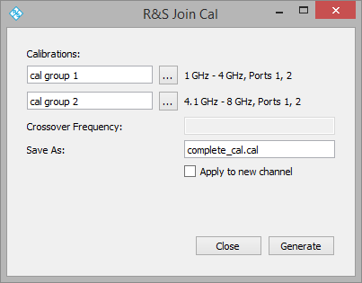

R&S Join Cal
============

Combines two separate calibrations into one.

This is useful for broadband calibrations where a particular approach is appropriate over part of the band but not appropriate for another part. For example, you may want to perform TRL at high frequencies but may not be physically able to perform this for low frequencies, or at least not be able to perform the calibration altogether.

Instructions
------------

Split the desired frequency range into two or more calibrations. Setup and perform those calibrations as you normally would. Optionally you may want to save these interim calibrations. Once complete, run Join Cal as many times as you need to to combine them into one single calibration, then use that calibration as you normally would.

Use of the application itself to combine two calibrations is self-explanatory.



### Crossover Frequency

If two calibrations overlap, a crossover frequency can be specified. It determines where the transition occurs between the corrections from the first and second calibration.

For example, for these two calibrations:

```
Calibration 1 - 1 GHz to 5 GHz
Calibration 2 - 3 GHz to 8 GHz
```

... a crossover frequency of 4 GHz would mean that the combined calibration would use corrections from Calibration 1 and 2 as follows:

```
Calibration 1 - 1 GHz to 4 GHz
Calibration 2 - 4+ GHz to 8 GHz
```

... where `4+ GHz` represents the next point in `Calibration 2` beyond 4 GHz.

### Apply to New Channel

This option creates a new channel with the frequency range of the resulting combined calibration, and applies that calibration to the channel. This can be convenient since ultimately the user wants to measure, with calibration applied, the entire frequency range.

### Segmented Sweeps

Because of the way the SCPI commands are implemented the application cannot access the specific segments used in a calibration. It can, however, access the frequency points used. Because of this, combining calibrations that are segmented sweeps means resorting to adding each point as a segment, which can lead to really slow operation and sometimes timeouts for sweeps with very many points.

When possible, try to limit your joined calibration to two calibrations each with linear sweeps for best performance and reliable operation of the utility.

This caveat may go away in the future if the SCPI command interface includes the necessary functionality to avoid this.
